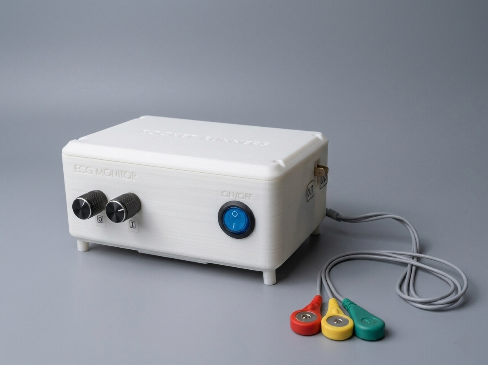
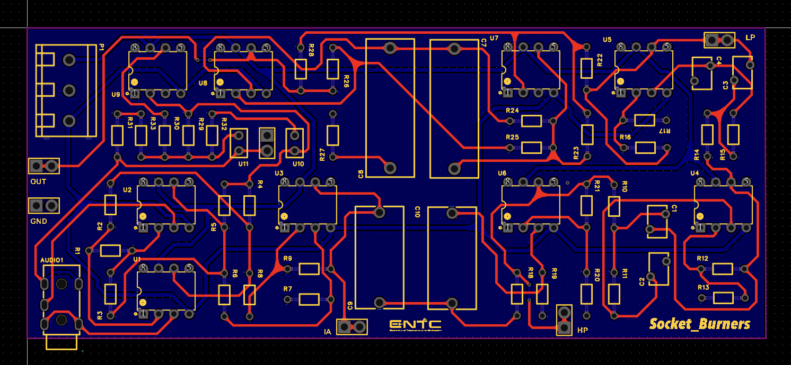
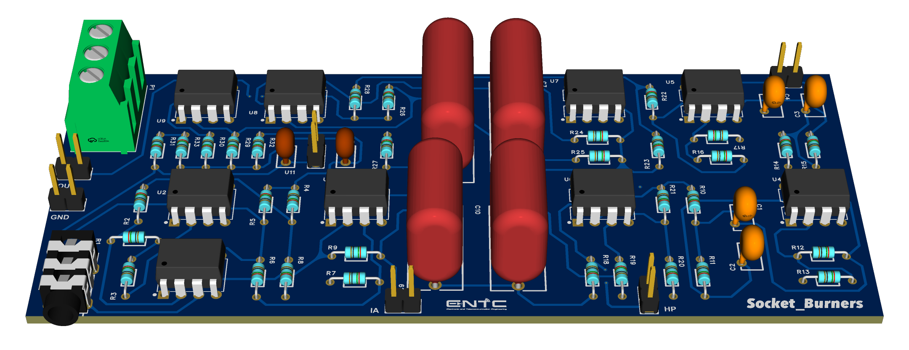
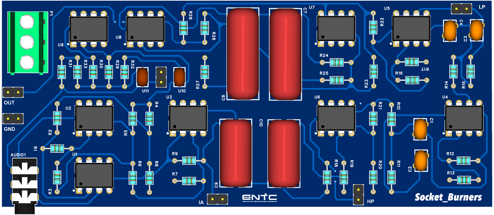
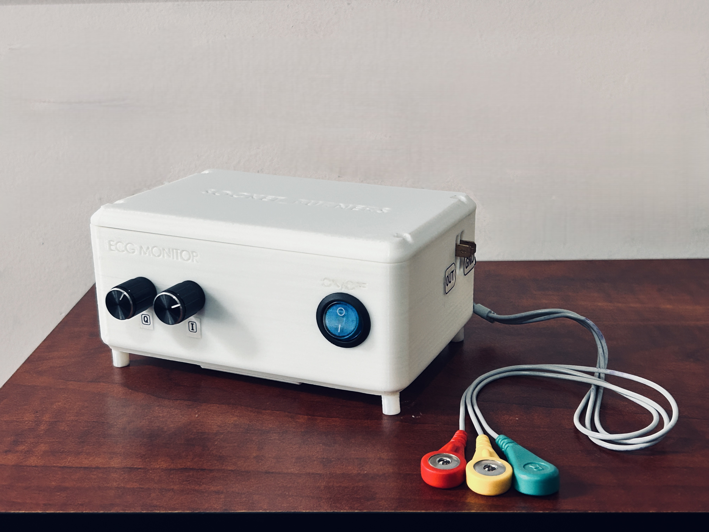

# 3-Lead ECG Monitor - AFE

A fully functional analog front end (AFE) for an electrocardiogram (ECG) monitor designed and developed using exclusively analog electronics for signal acquisition, amplification, and filtering. The device captures cardiac electrical activity through three electrodes and outputs a clean ECG waveform for real-time monitoring on an oscilloscope.

<p align=>
  
  &nbsp;&nbsp;&nbsp;&nbsp; &nbsp;&nbsp;&nbsp;&nbsp;&nbsp;&nbsp; &nbsp;&nbsp;&nbsp;&nbsp;&nbsp;&nbsp; &nbsp;&nbsp;&nbsp;&nbsp;&nbsp;&nbsp; &nbsp;&nbsp;&nbsp;
  
<p/>
  
## 🔬 Overview

This project demonstrates the design and implementation of a 3-lead ECG monitoring system built entirely with analog components. The device safely extracts weak bioelectric signals from the human body (10 μV to 5 mV), amplifies them, and filters noise to produce a diagnostic-quality ECG waveform suitable for cardiac monitoring.

### Key Specifications

- **Signal Range**: 10 μV - 5 mV input amplitude
- **Frequency Range**: 0.5 Hz - 100 Hz (cardiac signal bandwidth)
- **Electrode Configuration**: 3-lead setup (LA, RA, RL) following Einthoven's Triangle (Lead-I)
- **Power Supply**: Battery-operated (dual 7.4V Li-Ion) for minimal powerline interference
- **Output**: Analog signal for oscilloscope display

## ✨ Features

- **High-Precision Instrumentation Amplifier**: OP07-based differential amplifier with adjustable gain and excellent CMRR (120 dB)
- **Multi-Stage Filtering**:
  - 2nd Order High-Pass Butterworth Filter (0.5 Hz cutoff) - removes baseline wander
  - 4th Order Low-Pass Butterworth Filter (100 Hz cutoff) - eliminates high-frequency noise
  - Wien-Robinson Notch Filter (50 Hz) - suppresses powerline interference
- **Right Leg Drive (RLD) Circuit**: Active common-mode rejection for enhanced noise immunity
- **Safety-First Design**: Battery-powered operation ensures patient safety
- **Custom PCB**: Professional PCB layout optimized for low-noise analog signal processing
- **3D-Printed Enclosure**: Ergonomic, portable design with proper electrode connections

### Signal Processing Stages

1. **Instrumentation Amplifier**: Extracts differential voltage between LA and RA electrodes with variable gain
2. **High-Pass Filter**: Removes DC offset and baseline wander (fc = 0.589 Hz)
3. **Low-Pass Filter**: Eliminates muscle artifacts and high-frequency interference (fc = 100 Hz)
4. **Notch Filter**: Attenuates 50 Hz powerline noise (fc = 49.8 Hz, Q = 0.67)
5. **Right Leg Drive**: Inverts and feeds back common-mode signals for active noise cancellation

## 🔨 Hardware Implementation

### PCB Design
- **Software**: EasyEDA
- **Type**: Through-hole components for cost effectiveness and ease of assembly
- **Layout**: 2-Layer optimized for minimal noise coupling and proper grounding

<p align=>
  
  
   
<p/>
  
### Enclosure
- **Manufacturing**: 3D printed
- **Design**: Custom enclosure with cutouts for:
  - Output probes
  - Power switch
  - ECG leads
  - Potentiometer access for gain adjustment
    
 <p align=>
  
   &nbsp;&nbsp;&nbsp;&nbsp;
  
   &nbsp;&nbsp;&nbsp;&nbsp;
   
<p/>

## 📊 Testing Results

### Breadboard Prototype
- ✅ Successfully captured function generator ECG signals
- ✅ Verified with real human ECG signals
- ✅ Clean waveform with identifiable P, QRS, and T waves

<p align=>
  
 &nbsp;&nbsp;&nbsp;
  
<p/>
<p align=>
  <em>Input ECG Waveform :</em>
  <br/>
  
    
 
  <em>Output ECG Waveform :</em>
  <br/>
  
    

  <em>Overall Frequency Response :</em>
  <br/>
  


<p/>


### Final PCB Device
- ✅ Improved signal quality over breadboard implementation
- ✅ Reduced noise and interference
- ✅ Portable and user-friendly operation

<p align=>
  
 &nbsp;&nbsp;&nbsp;&nbsp;&nbsp;&nbsp;&nbsp;&nbsp;&nbsp;&nbsp;&nbsp;&nbsp;
  
<p/>

## 📁 Repository Structure

```
├── schematics/              # Circuit diagrams and design files
├── simulations/             # LTspice simulation files and results
├── pcb_design/              # KiCAD/Altium files, Gerber files, BoM
├── enclosure_design/        # 3D CAD models (.STL, .STEP files)
├── documentation/           # Project report, datasheets, calculations
├── testing/                 # Test results, oscilloscope captures
└── README.md               # This file
```

## 🚀 Getting Started

### Prerequisites
- PCB fabrication service (or equipment)
- Soldering equipment
- 3D printer (for enclosure)
- Standard ECG electrodes with 3.5mm connectors
- Oscilloscope for signal visualization
- 7.4V Li-Ion batteries (×4)

### Building the Device

1. **Clone the Repository**
   ```bash
   git clone https://github.com/yourusername/ecg-monitor.git
   cd ecg-monitor
   ```

2. **PCB Fabrication**
   - Navigate to `pcb_design/`
   - Send Gerber files to PCB manufacturer
   - Order components from BoM

3. **Assembly**
   - Solder components following the schematic
   - Test each stage individually before integration
   - Calibrate gain and notch filter potentiometers

4. **Enclosure**
   - Print enclosure from `enclosure_design/` files
   - Assemble PCB into enclosure
   - Connect battery pack and electrode leads

5. **Testing**
   - Use function generator with cardiac mode for initial testing
   - Test with real ECG signals
   - Adjust potentiometers for optimal signal quality

## 👥 Team SocketBurners

- [Buddhima Imbulpitiya](https://github.com/buddhima-imbulpitiya)
- [Oshan Imaduwage](https://github.com/oshan-imaduwage)
- [Malinda Illankoon](https://github.com/malindailankoon)
- [Manitha Ayanaja](https://github.com/ManiiAya)
